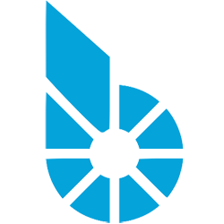
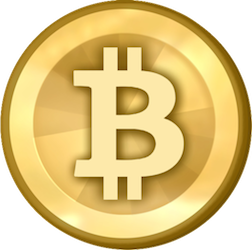
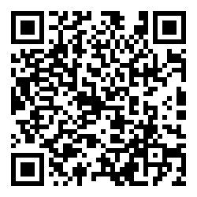

# Послесловие от переводчика

Ещё задолго до того, как персональные компьютеры и многофункциональные мобильные телефоны стали доступной и неотъемлемой частью нашей жизни, стало ясно: финансовая система планеты будет меняться. Дело тут не в «заговоре» правительств и даже не в банках. Мир изменился. Окончательно это стало ясно 6 -7 лет назад, когда появился Bitcoin. C тех пор в мире криптовалют отгремели десятки войн, зародились и благополучно канули в лету десятки проектов, многочисленные мошенники изрядно поспособствовали развитию делового чутья у лояльных к криптовалютам пользователей, в систему были влиты десятки миллионов долларов, как грибы после дождя вырастали и лопались «криптовалютные биржи», оставляя после себя долги и недовольных. Всё это было. Возможно, когда-нибудь эти истории (в изрядно приукрашенном виде) будут преподавать в школах. Возможно забудут.

Одно ясно, и с этим не будут спорить даже самые большие противники криптовалют: основанные на технологии цепочки блоков системы пришли к нам всерьёз и надолго.

Наверное, BitShares - это самая интересная криптосистема, появившаяся после Bitcoin. Значительные инвестиции, сделанные в неё, являются тому подтверждением.

Однако вне зависимости от того, собираетесь ли вы становиться инвестором криптовалют, являетесь ли их пользователем или вовсе только проявляете осторожное любопытство (либо даже терпеть их не можете и намерены «узнать врага в лицо»), надеемся, вы получили удовольствие от детального описания одной из самых сложных и многообещающих на сегодняшний день криптовалютных платформ - BitShares.

Первая редакция книги на русском языке (в отличие от английского варианта), предлагается читателям бесплатно.

Если вы сочтёте труд локализаторов полезным для себя и достойным оплаты, ниже вы найдёте адреса для пожертвований. Также вы можете подписаться на рассылку о новостях системы BitShares по адресу:
http://bitshares.us3.list-manage.com/subscribe?u=ac6976e87d9e9f0eac4bbf19c&id=a18e5c0fa1

**Адреса для пожертвований:**

 

BitShares: **adarin**

 

Bitcoin: **13M7rNaLWq7J5GFxMysfCkv3MiJgNtdgPt**
